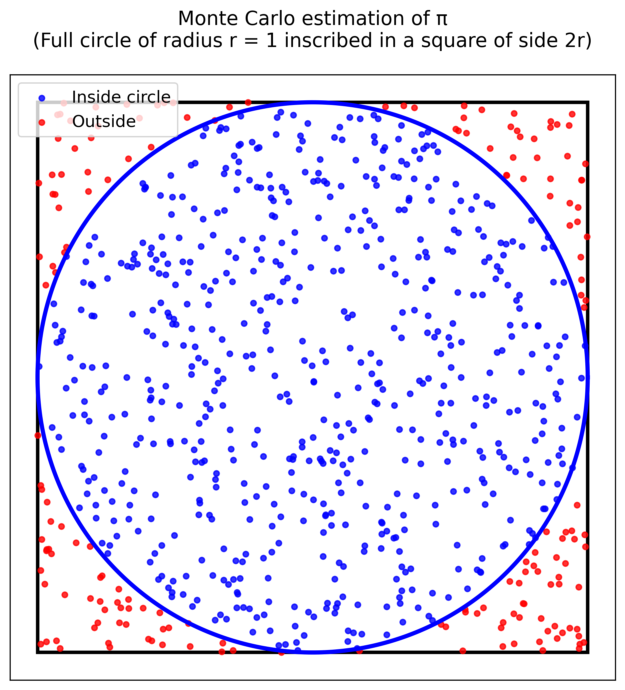

# Monte_Carlo_Pi
This project reflect the course work that touch the classic *Monte Carlo simulation*.

## General Logic


- Area of the square: $$4r^2$$
- Area of the circle: $$\pi r^2$$

The probability of randomly having a point falls inside the circle:

- $$P = \frac{\pi r^2}{4r^2} = \frac{\pi}{4}$$

We can then calculate π as:

- $$\pi = 4P$$

### Quick Start
Clone the repository
```bash
git clone https://github.com/AnaOnTram/Monte_Carlo_Pi.git
```

Compile the scripts
* NVIDIA Cards ONLY!
* You should have cuda toolkit installed!
```bash
#Pi calculation
nvcc monte_pi.cu -o monte_pi -lm

#GPU Floatpoint Benchmark (RTX30xx: sm80 RTX40xx: sm89 Jetson Orin: SM87 RTX50xx: sm120)
nvcc -O3 -use_fast_math -arch=sm_[YOUR_GPU_ARCH] benchmark.cu -o benchmark
```
You can now execute the program
```bash
./monte_pi #High Precision Compute
./benchmark # Benchmark GPU Performance
```
### Benchmark Reference
- A5500 Mobile
```bash
Enter approximate total number of samples (e.g. 100000000): 10000000000000
Benchmarking with:
  - Grid Size: 5508068
  - Block Size: 256
  - Samples Per Thread: 1000
  - Total Samples: 1410065408000

Performance Metrics:
------------------------
Estimated Pi: 3.14159
Error: 3.68385e-06
Kernel Time: 19744.1 ms
Throughput: 7.14172e+10 samples/s (71.4172 GS/s)
```
- Jetson Orin Nano Super
```bash
Enter approximate total number of samples (e.g. 100000000): 10000000000000000
Benchmarking with:
  - Grid Size: 5141152
  - Block Size: 256
  - Samples Per Thread: 1000
  - Total Samples: 1316134912000

Performance Metrics:
------------------------
Estimated Pi: 3.14159
Error: 3.86614e-06
Kernel Time: 142873 ms
Throughput: 9.21195e+09 samples/s (9.21195 GS/s)
------------------------

